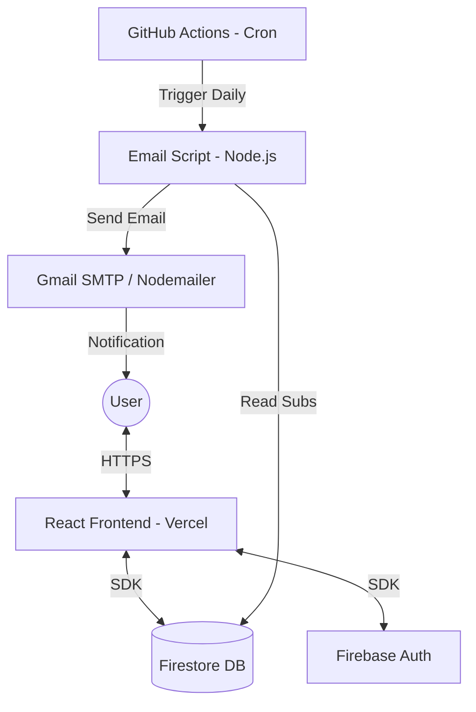

# 📑 Cutoff Project Architecture & Implementation

Cutoff is a subscription management application designed to help users track their recurring services and prevent unexpected charges through timely email reminders.

---

## 🏗️ 1. System Architecture

The project follows a **Serverless-Hybrid Architecture**:
- **Frontend**: A React Single Page Application (SPA) that interacts directly with Firebase for Authentication and Firestore.
- **Backend-as-a-Service (BaaS)**: Firebase handles the core backend logic, including user management and real-time database synchronization.
- **Automated Workflows**: GitHub Actions serves as the automation layer, running a Node.js script daily to check for expiring subscriptions and dispatching email notifications.

### High-Level Design


---

## 💻 2. Frontend Implementation

The frontend is built with **React 19** and focuses on a clean, premium user experience with custom serif typography.

### Core Technologies
- **Framework**: React 19
- **Routing**: `react-router-dom` (Version 7)
- **Styling**: Vanilla CSS (embedded in JS for component-level control)
- **Firebase integration**: `react-firebase-hooks` for seamless auth and data fetching.

### Project Structure
- `src/App.js`: Main router and protected route logic.
- `src/firebase.js`: Firebase configuration and initialization.
- `src/pages/`:
  - `Landing.js`: Marketing page with scroll-reveal animations and FAQ.
  - `Dashboard.js`: The main application view. Handles CRUD operations for subscriptions, searching, and filtering.
  - `Login.js` / `Signup.js`: Authentication flows.
  - `ExtensionPopup.js`: A specialized view for the Chrome Extension integration.

### Chrome Extension Integration
The app includes a feature where appending `?ext=true` to the URL triggers the `ExtensionPopup` component. This allows the same codebase to power both the web dashboard and a slimmed-down popup interface for browser extensions.

---

## ⚙️ 3. Backend & Automation

Instead of a dedicated 24/7 backend server, the project uses a highly cost-effective automation strategy.

### 🗄️ Database Schema (Firestore)
The `subscriptions` collection stores:
- **Identifier**: `userId` (links to Firebase Auth).
- **Core Info**: `name`, `platform`, `cost`, `notes`.
- **Dates**: `startDate`, `endDate`.
- **Contact**: `email` (for notifications), `phone`.
- **State**: `reminderSent5`, `reminderSent3`, `reminderSent1` (booleans to track sent notifications).

### 📧 Notification Engine (`scripts/sendReminders.js`)
A Node.js script that:
1. Initializes the **Firebase Admin SDK**.
2. Fetches all active subscriptions from Firestore.
3. Calculates `daysLeft` for each subscription.
4. Uses **Nodemailer** to send HTML-formatted emails at the 5, 3, and 1-day milestones.
5. Updates the Firestore document flags (`reminderSentX`) to ensure each reminder is sent exactly once.

### 🤖 Automation (GitHub Actions)
Located in `.github/workflows/reminders.yml`:
- **Trigger**: Runs every day at 2:30 AM UTC (8:00 AM IST).
- **Process**: Installs dependencies in the `scripts` folder and executes the reminder script.

---

## 🛠️ 4. Setup & Deployment Process

### Prerequisites
- [Node.js](https://nodejs.org/) (v18+)
- A [Firebase Project](https://console.firebase.google.com/)
- A Gmail account with an [App Password](https://myaccount.google.com/apppasswords)

### Step 1: Frontend Setup
1. Clone the repository and install dependencies:
   ```bash
   npm install
   ```
2. Create a `.env` file in the root with your Firebase credentials (or update `src/firebase.js`).
3. Start the dev server:
   ```bash
   npm start
   ```

### Step 2: Backend (Scripts) Setup
1. Navigate to the `scripts` directory:
   ```bash
   cd scripts
   npm install
   ```
2. Download your **Firebase Service Account Key** JSON from Firebase Console → Project Settings → Service Accounts.
3. Securely provide this key as a GitHub Secret or environment variable.

### Step 3: Deployment & Automation
1. **Frontend**: Deploy the root folder to **Vercel** or **Netlify**. Ensure the "Build Command" is `npm run build` and the output directory is `build`.
2. **GitHub Secrets**: Add the following secrets to your GitHub repository:
   - `FIREBASE_SERVICE_ACCOUNT`: The full content of your Service Account JSON.
   - `GMAIL_USER`: Your Gmail address.
   - `GMAIL_PASS`: Your 16-character Gmail App Password.

---

## 📌 Architecture Highlights
- **No-Cost Backend**: Uses GitHub Actions for cron jobs, avoiding the need for a persistent server.
- **Responsive Design**: The dashboard adapts to mobile, tablet, and desktop views.
- **Secure**: All database access is scoped to the `userId`, regulated by Firebase Security Rules.
